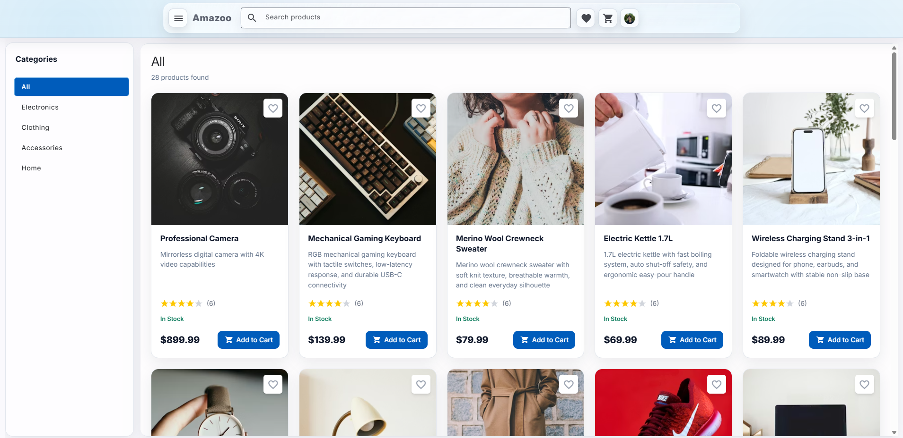
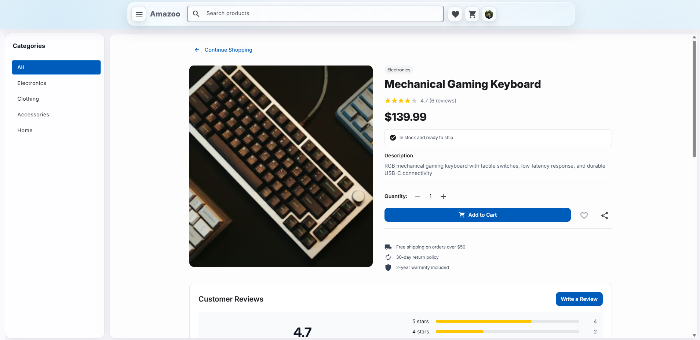
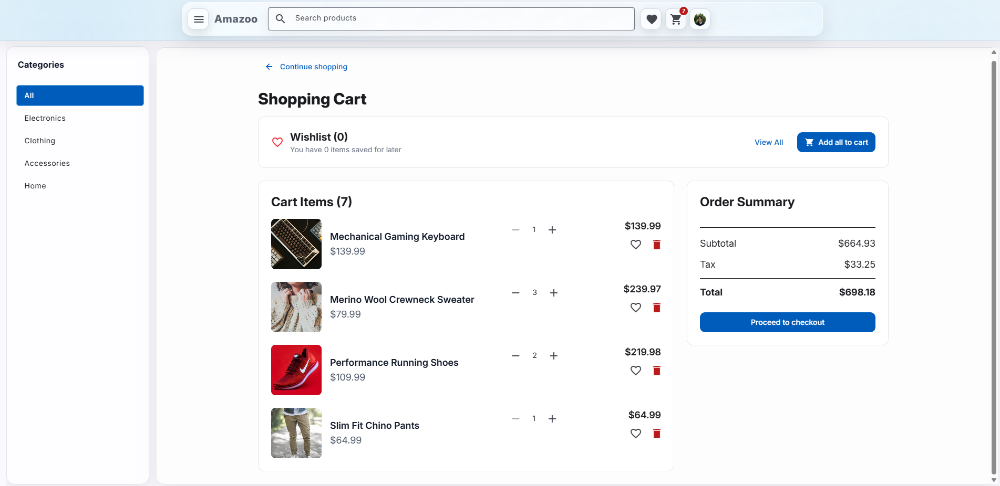
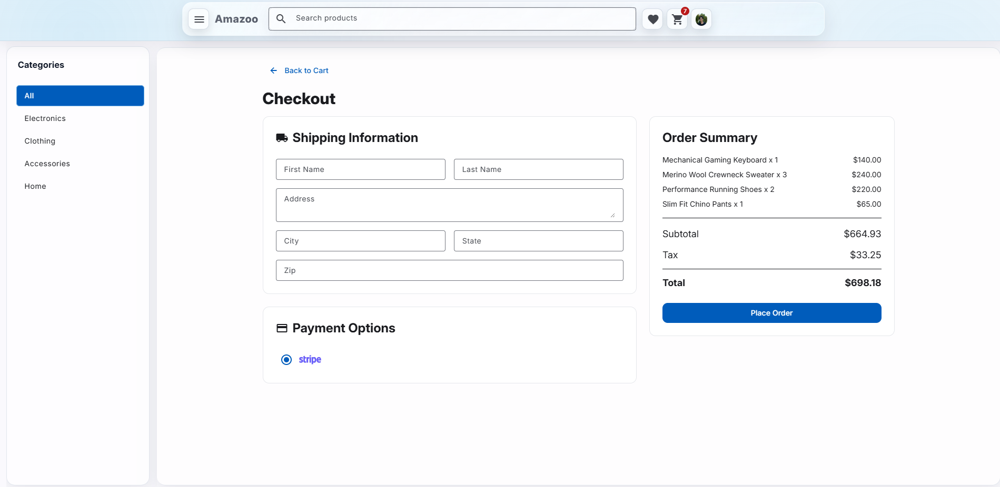
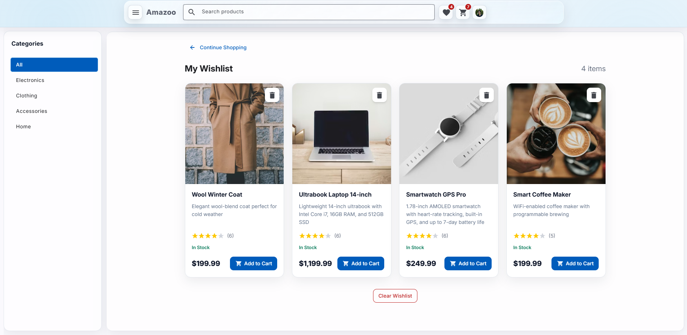

# 🛍️ Amazoo — Angular Signal-Driven E-Commerce App

A modern e-commerce frontend built with Angular 21, powered by Signals and designed with Material 3 + Tailwind.

This project demonstrates scalable frontend architecture, centralized state management, and a complete shopping flow, from browsing to checkout.

## 🚀 Live Features

### 🏠 Product Catalog

- Category filtering
- Full-text search
- Rating & stock indicators
- Responsive product grid



### 📦 Product Detail

- Dynamic rating & reviews
- Quantity selector
- Add to cart / wishlist
- Review submission (authenticated flow)



### 🛒 Cart & Checkout

- Real-time cart updates
- Tax & total calculation
- Checkout gating via authentication
- Order confirmation flow




### ❤️ Wishlist

- Add / remove items
- Move to cart
- Persistent state (local storage)



## 🧠 Architecture Overview

### 🏗️ Feature-First Structure

```text
src/app/
 ├── features/
 │    ├── products/
 │    ├── cart/
 │    ├── wishlist/
 │    └── layout/
 ├── shared/
 ├── models/
 └── ecommerce-store.ts
```

- Domain-driven feature organization
- Standalone components
- Route-level lazy loading
- Centralized signal store

### ⚙️ State Management

The application uses a central Signal Store built with `@ngrx/signals`.

- Single source of truth
- Immutable updates via `immer`
- Computed selectors
- Local persistence (`cart`, `wishlist`, `user`)

Flow:  
`User Action → Store Method → State Update → Computed Signals → Reactive UI Update`

## 🧩 Tech Stack

- ⚡ Angular 21 (Standalone + SSR hydration)
- 🧠 NgRx Signals
- 🎨 Angular Material 3
- 🌬️ Tailwind CSS 4
- 🧪 TypeScript 5.9
- 🔄 Immer
- 🔔 Hot Toast Notifications

## 🎯 Key Engineering Decisions

- Feature-first architecture for scalability
- Centralized state for cross-page synchronization
- Signals instead of traditional reducers for lower boilerplate
- Local JSON data source for deterministic frontend iteration
- SSR compatibility for modern Angular capabilities

## 🛠️ Setup

```bash
git clone https://github.com/Laslousa/Amazoo.git
cd ecommerce-app
npm install
npm start
```

Visit:

```text
http://localhost:4200
```

## 📈 Future Improvements

- Backend API integration
- Real payment provider
- Advanced form validation
- Unit & E2E testing
- Role-based route guards
- Accessibility audit
